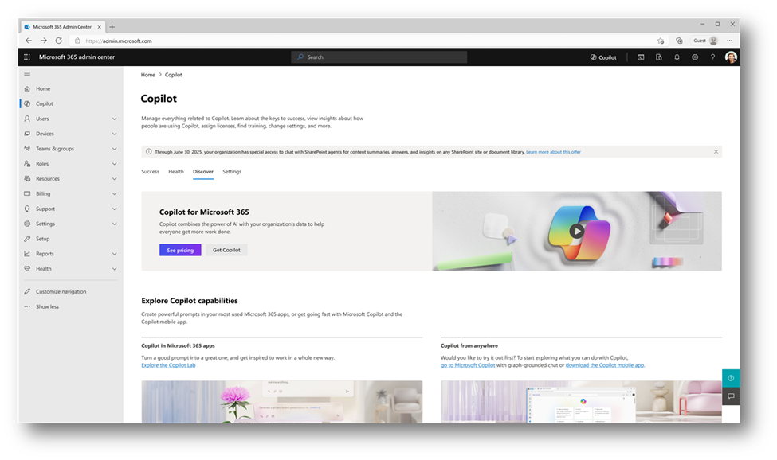
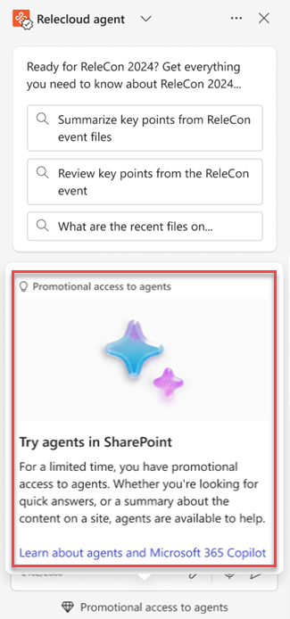
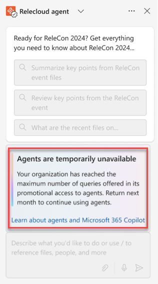

# Manage trial access to Agents in SharePoint with PowerShell

## What is the trial access to agents in SharePoint

During a promotional trial period starting from January 6, 2025, through June 30, 2025, organizations with 50 or more Microsoft 365 Copilot licenses automatically receive 10,000 queries per month for agents in SharePoint. This trial gives users without Copilot licenses access to create and use agents. As a SharePoint admin, you can disable this trial access using the [SharePoint Online Management Shell](/powershell/sharepoint/sharepoint-online/introduction-sharepoint-online-management-shell). View the [Trial Agreement details](/legal/microsoft-365/in-app-trials-terms-of-service).

## When will the trial access become available

The promotion trial goes into effect January 6, 2025, and remains active until June 30, 2025. As agents in SharePoint roll out, tenants will be eligible for this promotion. You as a [SharePoint Administrator](/sharepoint/sharepoint-admin-role) or [more](/microsoft-365/admin/add-users/about-admin-roles) can disable trial access at any point during the promotional period. Tenants that are eligible for the promotion see a message bar on the Copilot Admin page in the Admin Center.

## What you need to prepare for the trial access

Beginning in December 2024, you, as a SharePoint admin, can use the [SharePoint Online Management Shell](/powershell/sharepoint/sharepoint-online/introduction-sharepoint-online-management-shell) to manage access to the trial for users without Copilot licenses.

You can manage the trial access to agents in SharePoint by following these steps:

1. If you haven’t, update to the latest version of the SharePoint Online Management Shell
1. Run the following commands:

   | Action                                      | Command                              |
   |---------------------------------------------|--------------------------------------|
   | [Opt out and disable access to the trial](/powershell/module/sharepoint-online/set-spocopilotpromooptinstatus)  | `Set-SPOCopilotPromoOptInStatus -IsCopilotPromoStatusEnabled $false`     |
   | [Confirm trial settings to the trial](/powershell/module/sharepoint-online/get-spocopilotpromooptinstatus) | `Get-SPOCopilotPromoOptInStatus`     |
   | [Re-enable access](/powershell/module/sharepoint-online/set-spocopilotpromooptinstatus)  | `Set-SPOCopilotPromoOptInStatus -IsCopilotPromoStatusEnabled $true`     |

   > [!IMPORTANT]
   > Ensure that you have the latest version of SharePoint PowerShell installed to run these cmdlets effectively.

## How the trial access affects your organization

  

Once the trial promotion is available, your unlicensed users are able to view and interact directly with agents in SharePoint. They'll receive a notification about their promotional access and be encouraged to start exploring the feature. If the user doesn't immediately see the Copilot button in the suite navigation bar, ask them to refresh the page.  
    

      

        

    

       Anytime these users interact with agents, their usage counts toward your organization’s monthly trial use of 10,000 queries. Once the maximum number of queries is reached, users are notified that the service is temporarily unavailable and prompted to try again next month. 
         
        Unused queries won't roll over to the following month. If you need more queries, you can get them by adding more Microsoft 365 Copilot licenses. After the trial ends on June 30, 2025, users without a Microsoft 365 Copilot License will no longer be able to create or use the agents. However, agents created and used during the trial promotion remain available, and no historical data are lost. 
        

    

      
    

## Additional information

- Learn more about [Copilot in SharePoint](https://support.microsoft.com/topic/44e981e7-dcef-4422-977d-967f3dcfe796)
